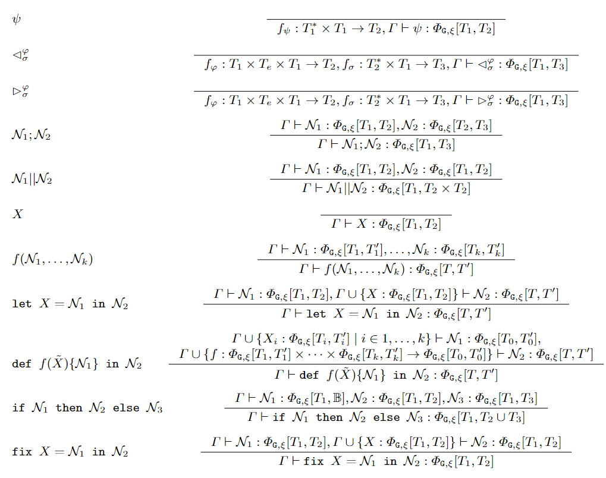
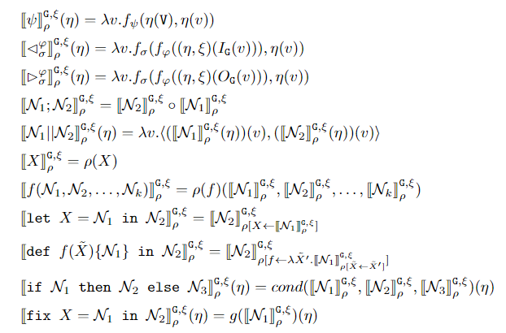

# Syntax and Semantics of μG

The syntax and denotational semantics of $\mu\mathcal{G}$ were published in our FORTE 2023 article[^1]
The operational semantics will be added here after being published in a future article.
[^1]: Matteo Belenchia, Flavio Corradini, Michela Quadrini, and Michele Loreti. 2023. Implementing a CTL Model Checker with μG, a Language for Programming
Graph Neural Networks. In Formal Techniques for Distributed Objects, Components, and Systems: 43rd IFIP WG 6.1 International Conference, FORTE 2023,
Held as Part of the 18th International Federated Conference on Distributed Computing Techniques, DisCoTec 2023, Lisbon, Portugal, June 19–23, 2023,
Proceedings. Springer-Verlag, Berlin, Heidelberg, 37–54. <https://doi.org/10.1007/978-3-031-35355-0_4>

## Syntax of $\mu\mathcal{G}$ { #syntax data-toc-label='Syntax of μG' }
We start by recalling the abstract syntax of $\mu\mathcal{G}$

!!! note "Syntax of $\mu\mathcal{G}$"

    Given a set $\mathcal{X} = \{X, Y, Z, \ldots \}$ of variable symbols and a set $\mathcal{S}$ of function symbols, $\mu\mathcal{G}$ expressions can be 
    composed with the following abstract syntax:

    \begin{align*} 
    \mathcal{N} ::=& \; \psi \mid \lhd_{\sigma}^{\varphi} \mid \rhd_{\sigma}^{\varphi} \mid \mathcal{N}_1 ; \mathcal{N}_2 \mid \mathcal{N}_1 || \mathcal{N}_2 \mid X  \mid f (\mathcal{N}_1, \mathcal{N}_2, \ldots, \mathcal{N}_k) \mid\\&
    \texttt{let } X = \mathcal{N}_1 \texttt{ in } \mathcal{N}_2 \mid \texttt{def } f (\tilde{X}) \{ \mathcal{N}_1 \} \texttt{ in } \mathcal{N}_2  \mid \\ &
    \texttt{if } \mathcal{N}_1 \texttt{ then } \mathcal{N}_2 \texttt{ else } \mathcal{N}_3 \mid \texttt{fix } X = \mathcal{N}_1 \texttt{ in } \mathcal{N}_2
    \end{align*}
    
    with $\varphi, \sigma, \psi, f \in \mathcal{S}$ and $X \in \mathcal{X}$ .

Given a graph $\mathtt{G}$ and an (optional) edge-labeling $\xi$, the meaning of a $\mu\mathcal{G}$ expression is a graph neural network, a function between node-labeling functions. 

One of the basic $\mu\mathcal{G}$ terms is the *function application*  $\psi$. This represents the application of a given function (referenced by $\psi$) to the input node-labeling function. 

Moreover, the *pre-image* operator $\lhd_{\sigma}^{\varphi}$ and the *post-image* operator $\rhd_{\sigma}^{\varphi}$ are used to compute the labeling of a node in terms of the labels of its predecessors and successors, respectively.

Basic terms are composed by *sequential composition* $\mathcal{N}_1 ; \mathcal{N}_2$ and *parallel composition* $\mathcal{N}_1 || \mathcal{N}_2$. 

Local *variables* $X$ and *functions* $f(\tilde{X})$ can be defined using `let` and ``def``.

The *choice* operator $\texttt{if } \mathcal{N}_1 \texttt{ then } \mathcal{N}_2 \texttt{ else } \mathcal{N}_3$ allows to run different GNNs according to the result of a guard GNN.

Finally, the *fixed point* operator $\texttt{fix } X = \mathcal{N}_1 \texttt{ in } \mathcal{N}_2$ is used to program *recursive behavior*.

## Typing of $\mu\mathcal{G}$ { #typing data-toc-label='Typing of μG' }

We say that a $\mu\mathcal{G}$ expression is *well-formed* whenever it can be typed with the rules of the following table.
These rules guarantee that any *well-formed* $\mu\mathcal{G}$ expression can be interpreted as a GNN.

## Denotational semantics of $\mu\mathcal{G}$ { #semantics data-toc-label='Denotational semantics of μG' }

We are now ready to discuss the denotational semantics of $\mu\mathcal{G}$. In the following definition, $\eta$ denotes a node-labeling function,
$O_{\mathtt{G}}(v)$ and $I_{\mathtt{G}}(v)$ are the outgoing and incoming edges of node $v$, and by $(\eta, \xi)(E)$ we denote the multi-set of tuples
$(\eta(u), \xi((u, v))), \eta(v))$ for each $(u, v) \in E$.

!!! note "Denotational semantics of $\mu\mathcal{G}$"

    *Given a graph $\mathtt{G}$, an edge-labeling function $\xi$, and an environment $\rho$ that comprises a variable evaluation function $\rho_v: \mathcal{X} \rightarrow \Phi_{\mathtt{G}, \xi}$
    and a function evaluation function
    $\rho_f: \mathcal{S} \rightarrow ((\Phi_{\mathtt{G}, \xi} \times \ldots \times \Phi_{\mathtt{G}, \xi}) \rightarrow \Phi_{\mathtt{G}, \xi})$ we define the
    semantic interpretation function $\cdot_{\rho}^{\mathtt{G},\xi}: \mathcal{N} \rightarrow \Phi_{\mathtt{G}, \xi}$ on $\mu\mathcal{G}$ formulas
    $\mathcal{N}$ by induction in the following way:*
    
    
    
    For any $\psi, \varphi, \sigma, f \in \mathcal{S}$ and any $X \in \mathcal{X}$. The functions $cond$ and $g$ are defined as follows:

    \[
    cond(t, f_{1}, f_{2})(\eta) = \begin{cases} 
    f_{1}(\eta) & \text{if } t(\eta) = \lambda v . \mathtt{True} \\
    f_{2}(\eta) & \text{otherwise}
    \end{cases}
    \]

    \[
      g(\Phi)(\eta) = \begin{cases}
    \Phi(\eta) & \text{if } \Phi(\eta) = \mathcal{N}_2_{\rho[X \leftarrow \Phi]}^{\mathtt{G},\xi}(\eta)\\
    g(\mathcal{N}_2_{\rho[X \leftarrow \Phi]}^{\mathtt{G},\xi})(\eta) & \text{otherwise}
    \end{cases}  
    \]

### Function application
The function symbols $\psi_1, \psi_2, \ldots \in \mathcal{S}$ are evaluated as the graph neural networks $\psi_1_{\rho}^{\mathtt{G},\xi},
\psi_2_{\rho}^{\mathtt{G},\xi}, \ldots$ that map a node-labeling function $\eta$ to a new node-labeling function by applying a function on both local and
global node information. The local information consists of applying $\eta$ to the input node, while the global information is the multiset of the labels of
all the nodes in the graph. The graph neural network we obtain applies a possibly trainable function $f_\psi$ to these two pieces of information.
Two particular cases arise if $f_\psi$ decides to ignore either of the two inputs. If $f_\psi$ ignores the global information, the GNN returns a node-labeling
function $\eta_l$, a purely local transformation of the node labels. On the other hand, if $f_\psi$ ignores the local information, the GNN returns a
node-labeling function $\eta_g$ that assigns to each node a label that summarizes the entire graph, emulating what in the GNN literature is known as a
*global pooling* operator.

### Pre-image and Post-Image
The pre-image symbol $\lhd$ and the post-image symbol $\rhd$, together with function symbols $\varphi \in \mathcal{S}$ and $\sigma \in \mathcal{S}$ are
evaluated as the graph neural networks $\lhd_{\sigma}^{\varphi}_{\rho}^{\mathtt{G},\xi}$ and $\rhd_{\sigma}^{\varphi}_{\rho}^{\mathtt{G},\xi}$ for any
$\sigma, \varphi \in \mathcal{S}$. In the case  of the pre-image, for any symbol $\varphi \in \mathcal{S}$ the corresponding function $f_\varphi$ generates
a *message* from a tuple $(\eta(u), \xi((u, v)), \eta(v))$, and this is repeated for each $(u, v) \in I_{\mathtt{G}}(v)$. Then for any symbol $\sigma \in \mathcal{S}$ the corresponding
function $f_\sigma$ generates a new label for a node $v$ from the multiset of messages obtained from $f_\varphi$ and the current label $\eta(v)$. The functions
$f_\varphi$ and $f_\sigma$ may be trainable. The case of the post-image is analogous, with the difference that $f_\varphi$ is applied to tuples $(\eta(v),
\xi((v, u)), \eta(u))$ for each $(v, u) \in O_{\mathtt{G}}(v)$ instead.

### Sequential composition
An expression of the form $\mathcal{N}_1 ; \mathcal{N}_2$ for $\mu\mathcal{G}$ formulas $\mathcal{N}_1, \mathcal{N}_2$ is evaluated as the graph neural network
$\mathcal{N}_1 ; \mathcal{N}_2_{\rho}^{\mathtt{G},\xi}$ that maps a node-labeling function $\eta$ to a new node-labeling function obtained from the function composition of
$\mathcal{N}_2_{\rho}^{\mathtt{G},\xi}$ and $\mathcal{N}_1_{\rho}^{\mathtt{G},\xi}$.

### Parallel composition 
An expression of the form $\mathcal{N}_1 || \mathcal{N}_2$ for $\mu\mathcal{G}$ formulas $\mathcal{N}_1, \mathcal{N}_2$ is evaluated as the graph neural network
$\mathcal{N}_1 || \mathcal{N}_2_{\rho}^{\mathtt{G},\xi}$ that maps a node-labelling function $\eta$ to a new node-labelling function that maps a node $v$ to the tuple $\langle
\mathcal{N}_1_{\rho}^{\mathtt{G},\xi}(\eta)(v), \mathcal{N}_2_{\rho}^{\mathtt{G},\xi}(\eta)(v)\rangle$. Moreover, combining this operator with the basic function symbols $\psi_1, \psi_2, \ldots \in
\mathcal{S}$ allows the execution of $k$-ary operations on the node-labelling functions: a $k$-ary function application $f_{op_k}(\mathcal{N}_1, \ldots,
\mathcal{N}_k)$ is expressible as the $\mu\mathcal{G}$ expression $((\ldots(\mathcal{N}_1 || \mathcal{N}_2) || \ldots) || \mathcal{N}_k);op_k$.

### Choice
The choice operator $\texttt{if } \mathcal{N}_1 \texttt{ then } \mathcal{N}_2 \texttt{ else } \mathcal{N}_3$ for $\mu\mathcal{G}$ formulas $\mathcal{N}_1, \mathcal{N}_2, 
\mathcal{N}_3$ is evaluated as the graph neural network $\mathcal{N}_2_{\rho}^{\mathtt{G},\xi}$ if $\eta' = \mathcal{N}_1_{\rho}^{\mathtt{G},\xi}(\eta)$ is a node-labelling function such
that $\forall v \in \mathtt{G}, \eta'(v) = \mathtt{True}$. Otherwise it is evaluated as the graph neural network $\mathcal{N}_3_{\rho}^{\mathtt{G},\xi}$.

### Fixed points
The fixed point operator is evaluated as the graph neural network that is obtained by applying $\mathcal{N}_1_{\rho}^{\mathtt{G},\xi}$ to the least fixed point of the functional
$\mathcal{F}$ associated to $g$. Formally, it is $\bigsqcup\{\mathcal{F}^n \mid n \geq 0\}(\mathcal{N}_1_{\rho}^{\mathtt{G},\xi})$ where

$$
\begin{align*}
&\mathcal{F}^0 = \lambda \Phi . \lambda \eta . \bot \\
&\mathcal{F}^{n+1} = \mathcal{F}(\mathcal{F}^n) \\
\end{align*}
$$

