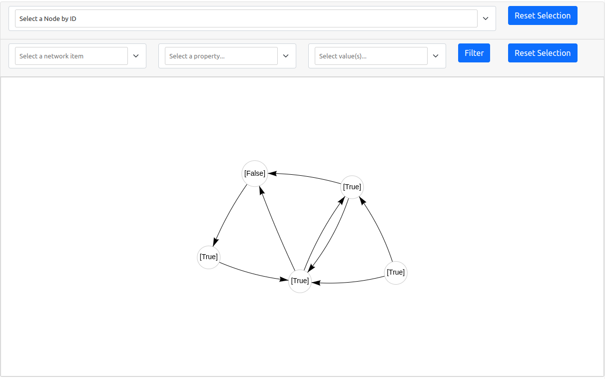
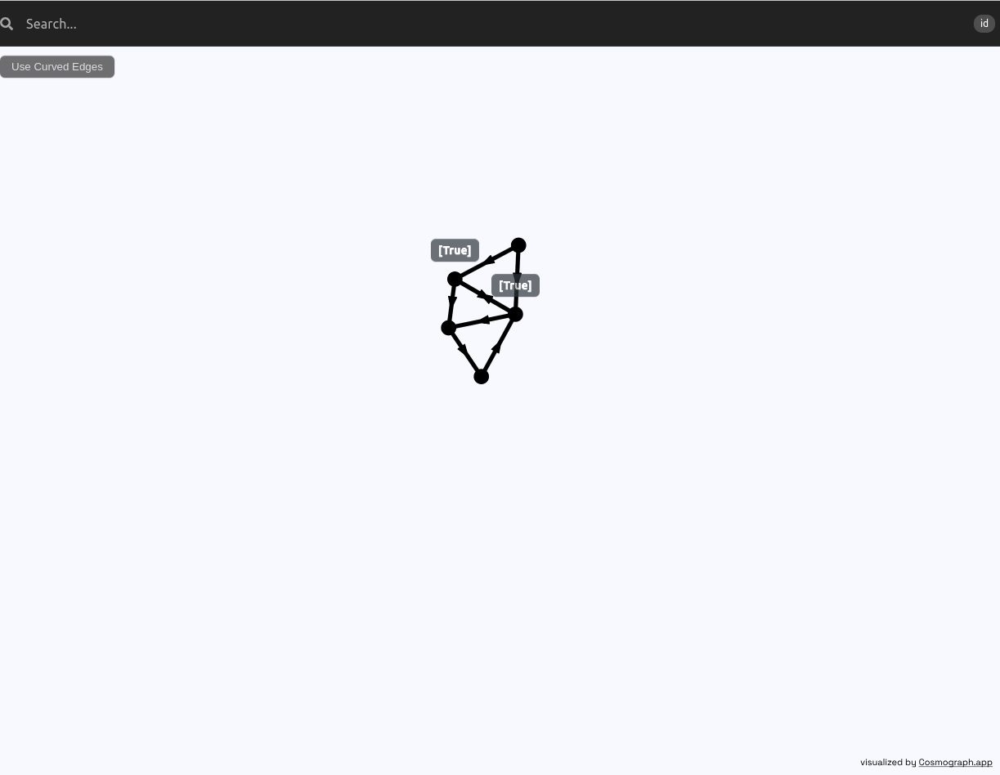

# Visualization procedures

<span style="font-variant:small-caps;">libmg</span> offers visualization procedure both for Spektral `Graph` objects and $\mu\mathcal{G}$ model outputs. 
Currently two visualization engines are supported: [PyVis](https://github.com/WestHealth/pyvis) and [Cosmograph](https://cosmograph.app/). PyVis is a 
Python binding for [vis.js](https://visjs.org/), a Javascript library for dynamic visualizations in the browser. Cosmograph is a React library built on 
[cosmos](https://github.com/cosmograph-org/cosmos), a GPU-accelerated Force Graph layout algorithm and rendering engine.

## Engine features and recommendations
### Pyvis

On the web page generated using PyVis it is possible to move around nodes by dragging them with the mouse pointer, to make the graph clearer to see. The 
entire graph can be moved by dragging on an empty spot. Hovering a node with the pointer will show its ID. On the search bar at the top is possible to 
select a node by ID. Below the search bar there is a filter bar that allows to filter nodes and edges according to their ID or label.

!!! note
    We recommend the usage of PyVis only for small graph instances (nodes in the order of the hundreds). 

!!! note
    The pyvis engine generates a single index.html file

### Cosmograph

On the web page generated using Cosmograph it is not possible to move individual nodes, but right-clicking on an empty spot will "shake" the simulation a 
little. The entire graph can be moved by dragging on an empty spot. Hovering a node will temporarily replace its label with its ID. On the search bar at the 
top is possible to select a node by ID or by label. Finally, a button below the search bar allows to toggle the shape of the edges, which can be either 
straight (default) or curved. Curved edges may slow the simulation but it may make it easier to see the links between the nodes.

!!! note
    For the time being, the Cosmograph engine doesn't show edge labels.

!!! note
    The pyvis engine generates a directory, inside which is situated the index.html that should be opened in the browser.

## Visualizing a `Graph`

To visualize a graph, simply call the `print_graph` function on a `Graph` instance:

```python
from libmg import Graph, print_graph

graph = Graph(...)
print_graph(graph, show_labels=False, open_browser=True, filename='mygraph', engine='pyvis')
```

The other arguments of this function can be used to specify whether tho show the true labels (if present in the `Graph` instance), whether to automatically 
open the default web browser, a name for the generated file or directory, and the engine to be used.

## Visualizing a model output

To visualize the output of a model, call the `print_layer` function by passing in the model, its inputs and the layer to print. To print the output of a 
model it means to print the output of its last layer (with index -1):

```python
model = compiler.compile(...)
inputs, = next(iter(loader.load()))
print_layer(model, inputs, layer_idx=-1, filename='myoutputs', open_browser=True, engine='cosmo')
```
!!! note
    Since a loader always returns a tuple (containing either only the actual inputs, or the inputs and the true labels), remember to unpack the tuple with
    `inputs, = next(iter(loader.load()))` or `inputs, y = next(iter(loader.load()))`.

The layer to print does not have to be the last, but can be any layer of the model. To specify the layer, we can provide either the integer index or its name.
The integer index of a layer can be found calling `model.summary()` and it can be positive or negative, with negative numbers have the usual meaning in 
Python. The name of a layer is the $\mu\mathcal{G}$ expression corresponding to it, expressed either as string or as parse tree (which is obtained by 
calling `mg_parser.parse` on the expression string). The name of the layer will be parsed by `mg_parser` if passed in as string, therefore parentheses can 
be used as needed.

```python
print_layer(model, inputs, layer_name='(a || b)', filename='myoutputs', open_browser=True, engine='cosmo')
# equivalent to
print_layer(model, inputs, layer_name='a || b', filename='myoutputs', open_browser=True, engine='cosmo')
```

!!! warning
    Do not print any of the layers corresponding the edge labels, the adjacency matrix, or the indices produced by the `MultipleGraphLoader`.
