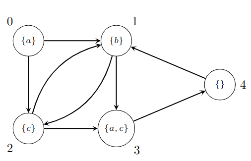
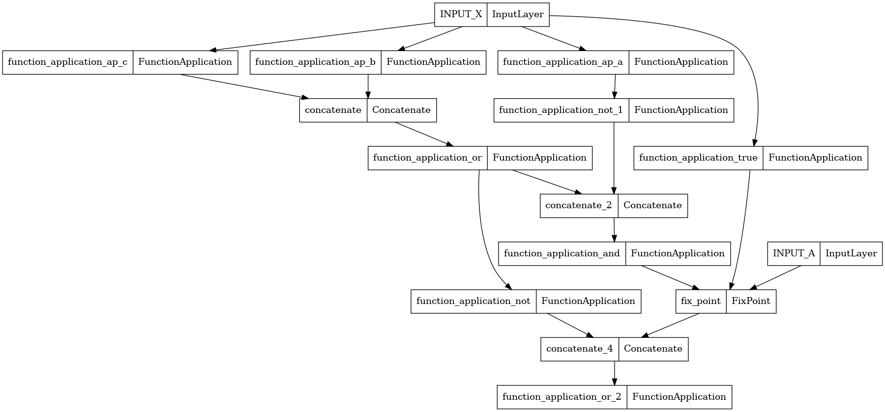
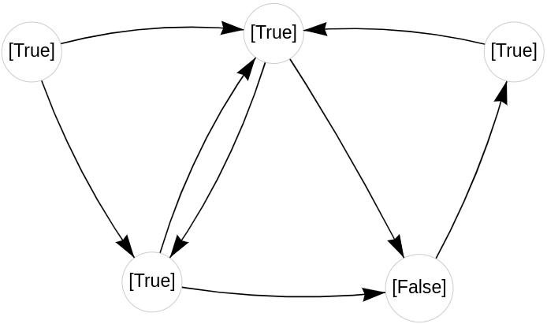
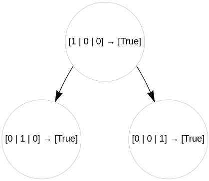

# CTL Model Checking

In this tutorial you will create a [Computation Tree Logic](https://en.wikipedia.org/wiki/Computation_tree_logic) (CTL) model checker using <span style="font-variant:small-caps;">libmg</span>.

We start by defining a `Dataset` that contains a single `Graph`. For this tutorial, we will simply obtain the graph on-the-fly using the `read` method.

```python
import numpy as np
from scipy.sparse import coo_matrix
from libmg import Dataset, Graph


class KripkeDataset(Dataset):
    def __init__(self, name):
        super().__init__(name)
        self.atomic_propositions = {'a', 'b', 'c'}

    def read(self):
        X = np.array([[1, 0, 0], [0, 1, 0], [0, 0, 1], [1, 0, 1], [0, 0, 0]], dtype=np.uint8)
        A = coo_matrix(([1, 1, 1, 1, 1, 1, 1, 1], ([0, 0, 1, 1, 2, 2, 3, 4], [1, 2, 2, 3, 1, 3, 4, 1])), shape=(5, 5), dtype=np.uint8)
        return [Graph(x=X, a=A)]


dataset = KripkeDataset("MyDataset")
```

The node features are three-dimensional multi-hot vectors of type `uint8`. Each node label is a multi-hot encoding of the atomic propositions that are satisfied 
in the corresponding state, given a specific ordering. For this tutorial we will consider three atomic propositions $a, b, c$ with order $a < b < c$. 
For example, in the first state we have the label `[1, 0, 0]` which means that in that state only proposition $a$ is satisfied. In the fourth state we have `
[1, 0, 1]` which means that propositions $a$ and $c$ are satisfied; in the last state, no proposition is satisfied.

The adjacency matrix will have `uint8` binary entries, and we don't have edge labels.

The dataset we have just defined and instantiated contains this graph[^1]:

[^1]: This graph in the context of CTL model checking is called a *Kripke structure*.

<figure markdown>

</figure>

To implement CTL model checking, we need to define the basic propositional logic operators for logic truth, falsity, disjunction,
conjunction and negation as $\psi$ functions. Additionally, we need a $\varphi$ function that just returns the label of the sender node and a $\sigma$ function
that aggregates messages using logical disjunction.

```python
import tensorflow as tf
from libmg import Constant, PsiLocal, Phi, Sigma

# Psi functions
b_false = Constant(tf.constant(False))
b_true = Constant(tf.constant(True))
b_and = PsiLocal(lambda x: tf.math.reduce_all(x, axis=1, keepdims=True))
b_or = PsiLocal(lambda x: tf.math.reduce_any(x, axis=1, keepdims=True))
b_not = PsiLocal(tf.math.logical_not)

# Phi functions
p1 = Phi(lambda i, e, j: i)

# Sigma functions
agg_or = Sigma(lambda m, i, n, x: tf.cast(tf.math.segment_max(tf.cast(m, tf.uint8), i), tf.bool))
```

We still need to define functions that recognize atomic propositions. To do so, each atomic proposition $p$ is mapped to the corresponding one-hot vector using 
the function `to_one_hot`, then using the `make` interface we define a `PsiLocal` function `ap` that is parametrized by the atomic 
proposition. If, for example, in a $\mu\mathcal{G}$ expression we write `ap[b]` the atomic proposition $b$ is mapped to the one-hot vector $(0, 1, 0)$ 
and then the dot product is computed with the label of the node. The result, once cast to Boolean values, is `True` if and only if the atomic proposition is
present in the node.

```python
def to_one_hot(label, label_set):
    label_set = sorted(label_set)
    index = label_set.index(label)
    vec = [0] * len(label_set)
    vec[index] = 1
    return tf.constant(vec, dtype=tf.uint8)

ap = PsiLocal.make_parametrized('ap', lambda p, x: tf.cast(tf.math.reduce_sum(x * to_one_hot(p, dataset.atomic_propositions), axis=1, keepdims=True), dtype=tf.bool))
```

We can now instantiate the `MGCompiler` by providing the dictionaries of functions and its configuration. In the configuration we specify the shape and type of
the node labels in input and the type of the adjacency matrix.

```python
from libmg import MGCompiler, CompilerConfig, NodeConfig

psi_functions = {'true': b_true, 'false': b_false,
                 'not': b_not, 'and': b_and,
                 'or': b_or, 'ap': ap}
sigma_functions = {'or': agg_or}
phi_functions = {'p1': p1}

config = CompilerConfig.xa_config(NodeConfig(tf.uint8, len(dataset.atomic_propositions)), tf.uint8, tolerance={})
compiler = MGCompiler(psi_functions=psi_functions,
                      sigma_functions=sigma_functions,
                      phi_functions=phi_functions,
                      config=config)
```

Next, we need to define a translation function that transforms a well-formed CTL formula into a valid $\mu\mathcal{G}$ program. To help with that we will use an
external library that provides a parser for CTL formulas, [pyModelChecking](https://pypi.org/project/pyModelChecking/). We also use a `var_generator` 
function to generate fresh fixpoint variable names.

```python
from pyModelChecking import CTL, Bool
import string
import itertools


def var_generator():
    var_length = 1
    gen = itertools.product(string.ascii_uppercase, repeat=1)
    while True:
        for v_tuple in gen:
            yield ''.join(v_tuple)
        var_length += 1
        gen = itertools.product(string.ascii_uppercase, repeat=var_length)

def to_mG(expr):
    def _to_mG(phi):
        if isinstance(phi, CTL.Bool):
            if phi == Bool(True):
                return "true"
            elif phi == Bool(False):
                return "false"
            else:
                raise ValueError("Error Parsing formula: " + phi)
        elif isinstance(phi, CTL.AtomicProposition):
            return str(phi)
        elif isinstance(phi, CTL.Not):
            return '(' + _to_mG(phi.subformula(0)) + ');not'
        elif isinstance(phi, CTL.Or):
            sub_formulas = list(set(phi.subformulas()))
            return '(' + ' || '.join(['(' + _to_mG(sub_formula) + ')' for sub_formula in sub_formulas]) + ');or'
        elif isinstance(phi, CTL.And):
            sub_formulas = list(set(phi.subformulas()))
            return '(' + ' || '.join(['(' + _to_mG(sub_formula) + ')' for sub_formula in sub_formulas]) + ');and'
        elif isinstance(phi, CTL.Imply):
            return _to_mG(CTL.Or(CTL.Not(phi.subformula(0)), phi.subformula(1)))
        elif isinstance(phi, CTL.E):
            sub_phi = phi.subformula(0)
            if isinstance(sub_phi, CTL.X):
                return "(" + _to_mG(sub_phi.subformula(0)) + ");|p1>or"
            elif isinstance(sub_phi, CTL.G):
                fixvar = next(fixvars)
                return "fix " + fixvar + " = true in (((" + _to_mG(sub_phi.subformula(0)) + ") || (" + fixvar + ";|p1>or));and)"
            elif isinstance(sub_phi, CTL.F):
                return _to_mG(CTL.EU(CTL.Bool(True), sub_phi.subformula(0)))
            elif isinstance(sub_phi, CTL.U):
                fixvar = next(fixvars)
                return "fix " + fixvar + " = false in (((((" + _to_mG(sub_phi.subformula(0)) + ") || (" + fixvar + ";|p1>or));and) || (" + _to_mG(sub_phi.subformula(1)) + "));or)"
        elif isinstance(phi, CTL.A):
            sub_phi = phi.subformula(0)
            if isinstance(sub_phi, CTL.X):
                return _to_mG(CTL.Not(CTL.EX(CTL.Not(sub_phi.subformula(0)))))
            elif isinstance(sub_phi, CTL.G):
                return _to_mG(CTL.Not(CTL.EU(CTL.Bool(True), CTL.Not(sub_phi.subformula(0)))))
            elif isinstance(sub_phi, CTL.F):
                return _to_mG(CTL.Not(CTL.EG(CTL.Not(sub_phi.subformula(0)))))
            elif isinstance(sub_phi, CTL.U):
                return _to_mG(CTL.Not(CTL.Or(CTL.EU(CTL.Not(sub_phi.subformula(1)),
                                                    CTL.Not(CTL.Or(sub_phi.subformula(0), sub_phi.subformula(1)))),
                                             CTL.EG(CTL.Not(sub_phi.subformula(1))))))
        else:
            raise ValueError("Error parsing formula ", phi)
    fixvars = var_generator()
    return _to_mG(CTL.Parser()(expr))
```

Finally, we can obtain our model by providing a CTL formula to the compiler. The property $\neg(b \lor c) \lor EG (\neg a \land (b \lor c))$ is first translated
into $\mu\mathcal{G}$ using `to_mG`, and then it is compiled into a TensorFlow model.

```python
expr = to_mG('~(b | c) | E G (~a & (b | c))')
model = compiler.compile(expr, memoize=True)
```

The function `to_mG` should have assigned `((fix A = true in ((((((a);not) || (((b) || (c));or));and) || (A;|p1>or));and)) || ((((b) || (c));or);not));or` 
to `expr`. Since we enabled memoization, the term corresponding to $b \lor c$ is computed only once, as can be seen by inspecting the model's structure using 
the `plot_model` function from TensorFlow.

```python
tf.keras.utils.plot_model(model)
```



We can now run the model on the dataset. We use the `SingleGraphLoader` to convert the graph into a list of `Tensor` objects and run the model using the 
`predict` API.

```python
from libmg import SingleGraphLoader

loader = SingleGraphLoader(dataset)
outputs = model.predict(loader.load(), steps=loader.steps_per_epoch)
```

The expected output is `[[True], [True], [True], [False], [True]]` corresponding to the fact that only state
$s_3$ doesn't satisfy the property. We can also visualize this result using `print_layer` on the last layer:

```python
from libmg import print_layer

inputs, = next(iter(loader.load()))
print_layer(model, inputs, layer_idx=-1, engine='pyvis')
```



Lastly, we can show how a certain node obtained its label. For example, node $s_0$ has been affected only by its direct neighbours, since the fixed-point 
computation converged in two steps:

```python
from libmg import MGExplainer

explainer = MGExplainer(model)
explainer.explain(0, inputs)
```
<figure markdown>

</figure>

In this tutorial, we have learned how to implement a CTL model checker in <span style="font-variant:small-caps;">libmg</span>. We have seen all the main 
capabilities of the library, spanning the definition of datasets, the definition of functions, the compilation of a model and its execution using the loaded 
dataset. We have also seen how to visualize the outputs of the model and how to explain them.